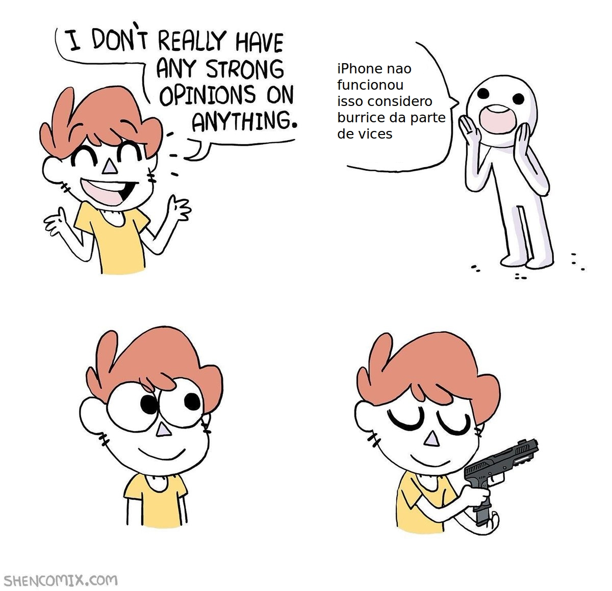

% FLOSS: Free and Libre Open Source Software

FLOSS
=
por lfz e amigos

O dilema
=

As quatro liberdades
=

* 0: A liberdade de executar o programa para qualquer efeito.
* 1: A liberdade de estudar como o programa funciona e adaptá-lo às suas necessidades.
* 2: A liberdade de redistribuir cópias, de modo que você pode ajudar os outros
* 3: A liberdade de aperfeiçoar o programa e fazer melhorias publicamente disponíveis, para toda comunidade se beneficiar.

Lendas
=

Vantagens
=

* Reúso e adaptação
* Distribuição facilitada e menor custo
* Menor barreira de entrada
* Decentraliazação do controle e do mercado
* Segurança
* Compartilhamento de conhecimento
* Comunidades
* Outras?

Desvantagens
=

* Decentralização da responsabilidade (tragédia dos comuns)
* Problemas de confiança e segurança
* Menor controle do indivíduo e da empresa
* Monetização e suporte
* E
* Outras?

Licenças
=

De todas cores e sabores

<https://www.gnu.org/licenses/>	

Tretas
=

Tretas
=

Tretas
=

* Copyleft e licenças virais
* BSD License
* GPLs e AGPL
* Conceito de liberdade

Minhas opinião / Discussão
=

* Importância da licença
* Relações de poder
* Implicações comportamentais
* Implicações socio/econômicas
* Centralização/decentralização

Projetos abertos / livres
=

* [OpenDrive](http://www.opendrive.org/)
* Rocket.chat
* Wordpress
* GNU/Linux
* [Mconf](https://mconf.org)
* [Canvas LMS](https://github.com/instructure/canvas-lms)

Projetos abertos/livres (parte 2)
=

* Standards?
* Internet?
* Bitcoin e altcoins?

Qual será o novo aberto?
=

